# Plan: Refactoring IdeaLab & Workspace for IO/Dev Perspectives

## 1. Zielsetzung

Dieses Dokument beschreibt den Plan zur Umstrukturierung der `IdeaLabView` und `WorkspaceView` sowie der zugehörigen Komponenten und Logik. Hauptziele sind:

*   **Klarere Struktur:** Bessere Organisation der Dateien, die die Trennung oder Anpassung basierend auf den Benutzerrollen (Idea Owner / Developer) widerspiegelt.
*   **Code-Reduzierung:** Vermeidung von Duplizierung durch adaptable Komponenten und geteilte Logik.
*   **Verbesserte Lesbarkeit & Wartbarkeit:** Logische Gruppierung von Funktionalitäten und klar definierte Verantwortlichkeiten.
*   **Rollenbasierte Anpassung:** Widgets und Ansichten sollen sich dynamisch an die Rolle des aktuellen Benutzers (IO oder Dev) anpassen.
*   **Minimale Eingriffe:** Änderungen sollen schrittweise erfolgen und nur das Notwendigste umfassen, um die Stabilität zu gewährleisten.

Betroffene Hauptbereiche: `src/views/IdeaLabView.svelte`, `src/views/WorkspaceView.svelte`, `src/backend/NegotiationManager.js` und Komponenten in `src/components/ideaLab/` und `src/components/workspace/`.

## 2. Aktuelle Struktur (Vereinfacht)

Die derzeitige Struktur organisiert Komponenten und Logik primär nach Ansichten (`IdeaLab`, `Workspace`) und allgemeinen Backend-Funktionen.

```mermaid
graph TD
    subgraph Views
        IdeaLabView["IdeaLabView.svelte"]
        WorkspaceView["WorkspaceView.svelte"]
    end

    subgraph Components
        subgraph IdeaLab
            IL_Manage["ideaLab/ManageContainer.svelte"]
            IL_Archive["ideaLab/ArchiveContainer.svelte"]
            IL_Stats["ideaLab/StatisticsContainer.svelte"]
            IL_Widgets["ideaLab/... (Widgets)"]
        end
        subgraph Workspace
            WS_Manage["workspace/ManageContainer.svelte"]
            WS_Archive["workspace/ArchiveContainer.svelte"]
            WS_Stats["workspace/StatisticsContainer.svelte"]
            WS_Widgets["workspace/... (Widgets)"]
        end
        Common["common/..."]
        Sidebar["Sidebar/..."]
        Footer["Footers/..."]
        Toolbar["Toolbar/..."]
    end

    subgraph Backend
        NegManager["NegotiationManager.js"]
        NostrMgr["NostrManagerStore.js"]
        NostrCache["NostrCacheStore.js"]
        NostrFactory["NostrEventFactory.js"]
    end

    subgraph Stores
        ModeStore["common/modeStore.js"]
        HelperStore["helperStore.js"]
    end

    subgraph Constants
        Kinds["constants/nostrKinds.js"]
    end

    IdeaLabView --> IL_Manage & IL_Archive & IL_Stats & Toolbar & Banner & ModeSelector
    WorkspaceView --> WS_Manage & WS_Archive & WS_Stats & Toolbar & Banner & ModeSelector

    IL_Manage & WS_Manage --> NegManager & NostrCache & NostrMgr
    IdeaLabView & WorkspaceView --> NostrMgr & Kinds & HelperStore & ModeStore

    NegManager --> NostrMgr & NostrCache & NostrFactory & Kinds
```

## 3. Vorgeschlagene Struktur & Konzept

Wir behalten die grundlegende Trennung in `views`, `components`, `backend`, `stores` bei, führen aber Konzepte zur Rollenunterscheidung und verbesserte Kapselung ein.

**Kernideen:**

1.  **Rollen-Store:** Einführung eines zentralen Stores (`src/stores/roleStore.js`), der die aktuelle Rolle des Benutzers (IO/Dev) verwaltet.
2.  **Adaptable Komponenten:** Komponenten innerhalb von `src/components/ideaLab/` und `src/components/workspace/` (insbesondere Widgets) erhalten den `roleStore` (oder den Rollenwert) als Prop und passen ihr Verhalten und ihre Darstellung dynamisch an.
3.  **View-spezifische Controller/Stores (Optional, bei Bedarf):** Wenn die Logik in den Views oder Containern komplex wird, können dedizierte Controller (`.js`-Dateien) oder Stores pro Ansicht (`IdeaLabStore.js`, `WorkspaceStore.js`) eingeführt werden. Diese würden die Interaktion mit dem Backend (`NegotiationManager`, `NostrManager`) kapseln und den Zustand für die jeweilige Ansicht verwalten.
4.  **Refactoring `NegotiationManager`:** Überprüfung, ob Methoden in `NegotiationManager` angepasst werden müssen, um unterschiedliche Logik für IO und Dev zu unterstützen oder ob dies besser in den adaptiven Komponenten gehandhabt wird.

**Vorgeschlagene Struktur (Änderungen hervorgehoben):**

```mermaid
graph TD
    subgraph Views
        IdeaLabView["IdeaLabView.svelte"]
        WorkspaceView["WorkspaceView.svelte"]
    end

    subgraph Components
        subgraph IdeaLab
            IL_Manage["ideaLab/ManageContainer.svelte"]
            IL_Archive["ideaLab/ArchiveContainer.svelte"]
            IL_Stats["ideaLab/StatisticsContainer.svelte"]
            IL_Widgets["ideaLab/... (Adaptable Widgets)"] -- Receives role --> RoleStore
        end
        subgraph Workspace
            WS_Manage["workspace/ManageContainer.svelte"]
            WS_Archive["workspace/ArchiveContainer.svelte"]
            WS_Stats["workspace/StatisticsContainer.svelte"]
            WS_Widgets["workspace/... (Adaptable Widgets)"] -- Receives role --> RoleStore
        end
        Common["common/..."]
        Sidebar["Sidebar/..."]
        Footer["Footers/..."]
        Toolbar["Toolbar/..."]
    end

    subgraph Backend
        NegManager["NegotiationManager.js (Potenziell angepasst)"]
        NostrMgr["NostrManagerStore.js"]
        NostrCache["NostrCacheStore.js"]
        NostrFactory["NostrEventFactory.js"]
    end

    subgraph Stores
        RoleStore["stores/roleStore.js (Neu)"]
        ModeStore["stores/common/modeStore.js"]
        HelperStore["helperStore.js"]
        IdeaLabStore["stores/ideaLabStore.js (Optional)"]
        WorkspaceStore["stores/workspaceStore.js (Optional)"]
    end

    subgraph Constants
        Kinds["constants/nostrKinds.js"]
    end

    IdeaLabView --> IL_Manage & IL_Archive & IL_Stats & RoleStore
    WorkspaceView --> WS_Manage & WS_Archive & WS_Stats & RoleStore

    IL_Manage & WS_Manage --> NegManager & NostrCache & NostrMgr & RoleStore
    IdeaLabView & WorkspaceView --> NostrMgr & Kinds & HelperStore & ModeStore & RoleStore

    NegManager --> NostrMgr & NostrCache & NostrFactory & Kinds
```

## 4. Notwendige Schritte

1.  **Erstellen `roleStore.js`:** Implementierung eines einfachen Svelte Stores zur Speicherung und Aktualisierung der Benutzerrolle (`'IO'` oder `'Dev'`). Der Initialwert muss basierend auf dem Benutzerkontext gesetzt werden (z.B. beim Login oder durch eine globale Einstellung).
2.  **Komponenten anpassen:**
    *   Identifizieren der Widgets und Container in `ideaLab` und `workspace`, die unterschiedliches Verhalten für IO und Dev benötigen.
    *   Hinzufügen einer `role` Prop oder Importieren des `roleStore` in diese Komponenten.
    *   Verwenden von `{#if $role === 'IO'}` oder ähnlichen Konstrukten in Svelte-Templates und Skript-Logik, um die Darstellung und Funktionalität anzupassen.
3.  **Views anpassen:** `IdeaLabView` und `WorkspaceView` müssen den `roleStore` importieren und ggf. an ihre Kindkomponenten weitergeben oder sicherstellen, dass die Kindkomponenten ihn selbst importieren.
4.  **`NegotiationManager` überprüfen:** Analyse, ob Methoden wie `submitOffer`, `acceptOffer`, `declineOffer` oder `get...` rollenspezifische Logik benötigen oder ob die Filterung/Anpassung besser auf der Frontend-Seite (in den Komponenten) erfolgen sollte. Ziel ist es, das Backend möglichst agnostisch zu halten.
5.  **(Optional) Controller/View-Stores einführen:** Falls die Logik in `ManageContainer`, `IdeaLabView` oder `WorkspaceView` zu komplex wird, Auslagerung in separate `.js`-Controller oder Svelte-Stores (`IdeaLabController.js`, `IdeaLabStore.js`, etc.). Diese würden die Interaktionen mit dem Backend und dem `roleStore` kapseln.
6.  **Tests & Refinement:** Nach jeder größeren Änderung testen, ob die Funktionalität für beide Rollen korrekt ist.

## 5. Design Prinzipien

*   **Rollenbasierte Adaptabilität:** Komponenten passen sich dynamisch an die IO/Dev-Rolle an.
*   **Separation of Concerns:** Klare Trennung von Ansicht (Layout), Store (State), Controller/Komponente (Logik) und Backend (Daten/Nostr).
*   **Single Source of Truth:** Der `roleStore` ist die einzige Quelle für die Benutzerrolle.
*   **Modularität:** Komponenten bleiben fokussiert und wiederverwendbar, wo sinnvoll.
*   **Nostr Compliance:** Einhaltung der Nostr-Prinzipien (Event-Immutabilität, korrekte Event-Struktur, NIPs beachten).

## 6. Erwartete Ergebnisse

*   Reduzierter Code durch Vermeidung von Duplikaten in IO/Dev-spezifischen Komponenten.
*   Eine logischere Dateistruktur, die die rollenspezifische Natur der Anwendung widerspiegelt.
*   Leichter verständlicher und wartbarer Code.
*   Flexibilität zur Erweiterung oder Anpassung für zukünftige Anforderungen. 