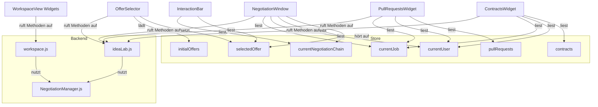

# Refactoring Plan: IdeaLab & Workspace Structural Improvement

## 1. Ziel und Motivation

Dieses Dokument beschreibt die geplante Umstrukturierung der Frontend-Architektur rund um die Views `IdeaLabView.svelte` und `WorkspaceView.svelte`. Ziel ist es, Code-Duplikate zu reduzieren, die Wartbarkeit zu erhöhen und eine klare, nachvollziehbare Struktur für die unterschiedlichen Rollen (Idea Owner, Developer) zu schaffen. Die bestehende Funktionalität bleibt erhalten, wird aber durch bessere Struktur und Trennung vorbereitet für zukünftige Erweiterungen.

## 2. Ziel-Dateistruktur (Tree)

```
src/
├── views/
│   ├── IdeaLabView.svelte
│   └── WorkspaceView.svelte
│
├── components/
│   ├── ideaLab/
│   │   ├── ManageContainer.svelte
│   │   ├── ArchiveContainer.svelte
│   │   ├── StatisticsContainer.svelte
│   │   ├── common/
│   │   │   └── JobSelector.svelte
│   │   ├── contracts/
│   │   │   └── ContractsWidget.svelte
│   │   └── pull_requests/
│   │       └── PullRequestsWidget.svelte
│   ├── workspace/
│   │   ├── ManageContainer.svelte
│   │   ├── ArchiveContainer.svelte
│   │   ├── StatisticsContainer.svelte
│   │   └── common/
│   │       └── JobSelector.svelte
│   ├── common/
│   │   ├── selectors/
│   │   └── negotiations/
│   │       ├── NegotiationWindow.svelte
│   │       ├── NegotiationWidget.svelte
│   │       ├── NegotiationBubble.svelte
│   │       ├── OfferSelector.svelte
│   │       ├── OfferFilter.svelte
│   │       └── InteractionBar.svelte
│   └── Widgets/
│       ├── RelaySelectionWidget.svelte
│       ├── PostIdeaWidget.svelte
│       ├── ProfileWidget.svelte
│       ├── ReviewWidget.svelte
│       ├── UserIdeasWidget.svelte
│       ├── EditProfileWidget.svelte
│       └── IdeaWidget.svelte
│
├── backend/
│   ├── ideaLab.js         # Methoden/Funktionen für IdeaLabView & Widgets (inkl. Contracts & Pull Requests)
│   ├── workspace.js       # Methoden/Funktionen für WorkspaceView & Widgets (inkl. Contracts & Pull Requests)
│   ├── negotiationCommon.js   # Hilfsfunktionen für Rollen, Pubkey, Chain-Analyse
│   ├── NegotiationManager.js
│   ├── NostrEventFactory.js
│   ├── JobManager.js
│   ├── CommunityJobManager.js
│   ├── NostrCacheManager.js
│   ├── NostrManagerStore.js
│   ├── DMManager.js
│   ├── SocialMediaManager.js
│   ├── RelayStore.js
│   ├── ZapManager.js
│   └── ...
│
├── stores/
│   ├── ideaLabStore.js
│   ├── workspaceStore.js
│
├── constants/
│   └── nostrKinds.js
```

**Hinweis:**
- Die bisherigen Backend-Manager `IdeaOwnerManager.js` und `DeveloperManager.js` werden im Zuge des Refactorings vollständig durch die neuen, pro-View-spezifischen Backend-Dateien `ideaLab.js` und `workspace.js` ersetzt. Nach Abschluss der Migration existieren nur noch die neuen Dateien – die alten Manager werden entfernt.
- **Sämtliche Logik für Contracts und Pull Requests wird in die jeweiligen Backend-Dateien `ideaLab.js` und `workspace.js` integriert. Separate Manager wie `ContractManager.js` und `PullRequestManager.js` entfallen.**

## 3. Designprinzipien (präzisiert)

- **Ein Store pro View, mehrere writables:**
  - Jede View (`ideaLabStore.js`, `workspaceStore.js`) enthält beliebig viele Svelte writables (z.B. `selectedOffer`, `currentNegotiationChain`, `initialOffers`, ...).
  - Jedes Widget erhält den Store als Property und kann auf beliebige writables anderer Widgets hören (z.B. `NegotiationWindow` hört auf `selectedOffer` von `OfferSelector`).
  - Der Store ist so strukturiert, dass alle für die Visualisierung und Interaktion nötigen Werte und Methoden elegant auffindbar und nutzbar sind.

- **Datenfluss und Abhängigkeiten:**
  - Widgets reagieren auf Änderungen in den relevanten writables und lösen ggf. Folgeaktionen aus (z.B. Chain-Fetch bei Offer-Wechsel).
  - Keine Imports von Stores oder Backend-Logik in Widgets selbst, alles wird als Prop übergeben.
  - Methoden/Funktionen werden zentral in einer Datei pro View gehalten und ggf. als Prop weitergereicht.
  - **Alle Logik zu Contracts und Pull Requests ist Teil der jeweiligen View-Backend-Datei.**

- **Rollenlogik:**
  - Widgets bestimmen ihre Rolle (IO/Dev/Observer) anhand der Store-Daten (z.B. `job.pubkey === userPubkey`).

- **Effizienz & Lightweight:**
  - Minimaler Boilerplate, maximaler Fokus auf Klarheit, Wiederverwendbarkeit und Testbarkeit.

## 4. Beispiel: Zusammenspiel der Widgets und Stores

- `OfferSelector.svelte` setzt `selectedOffer` im Store.
- `NegotiationWindow.svelte` hört auf `selectedOffer` und lädt daraufhin die `currentNegotiationChain`, die wiederum im Store abgelegt wird.
- Weitere Widgets können auf beliebige andere writables hören und so reaktiv auf State-Änderungen reagieren.

## 5. Mermaid-Diagramm: Beziehungen & Datenfluss



## 6. Beispiel: Store- und Widget-Nutzung

```js
// stores/ideaLabStore.js
import { writable } from 'svelte/store';
export const selectedOffer = writable(null);
export const initialOffers = writable([]);
export const selectedNegotiationChain = writable([]);
export const currentUser = writable(null);
export const selectedJob = writable(null);
export const contracts = writable([]);
export const pullRequests = writable([]);
// ... weitere writables
```

```svelte
<!-- NegotiationWindow.svelte -->
<script>
  export let store;
  $: $store.selectedOffer, $store.currentNegotiationChain;
  // Rolle bestimmen:
  $: isIO = $store.selectedJob?.pubkey === $store.currentUser?.pubkey;
  $: isDev = $store.selectedOffer?.pubkey === $store.currentUser?.pubkey;
</script>
<!-- Visualisierung je nach Rolle -->
{#if isIO}
  <!-- IO-spezifische UI -->
{:else if isDev}
  <!-- Dev-spezifische UI -->
{:else}
  <!-- Observer-UI -->
{/if}
```

## 7. Vorteile

- **Maximale Trennung von Logik und UI**
- **Eleganter, einheitlicher Datenfluss**
- **Wartbarkeit und Erweiterbarkeit**
- **Widgets sind universell testbar und wiederverwendbar**
- **Effizient und leichtgewichtig**

## 8. Nächste Schritte

1. Stores für beide Views konsolidieren und vereinheitlichen (mehrere writables pro Store)
2. Methoden-/Funktionsdateien pro View anlegen und alle Logik dorthin verschieben (inkl. Contracts & Pull Requests)
3. Alle relevanten Widgets auf Store-Prop und Rollenlogik umstellen
4. Svelte-Dateien von JS-Logik befreien
5. Testen und iterativ verfeinern 

## 9. Detaillierte Store- und Methodenstruktur (Deep Dive)

### 9.1. Writables pro Store (State pro View)

**`stores/ideaLabStore.js`** (analog für `workspaceStore.js`):

```js
import { writable } from 'svelte/store';

export const selectedIdea = writable(null);              // aktuell ausgewählte Idea
export const selectedJob = writable(null);               // aktuell ausgewählter Job
export const selectedOffer = writable(null);             // aktuell ausgewähltes Offer
export const initialOffers = writable([]);               // initiale Offers zu einem Job
export const selectedNegotiationChain = writable([]);    // aktuelle Verhandlungskette
export const contracts = writable([]);                   // Verträge zu Jobs/Offers
export const pullRequests = writable([]);                // PRs zu Jobs/Contracts
export const approvals = writable([]);                   // Approvals zu Offers
export const jobs = writable([]);                        // alle Jobs (IdeaLab: eigene, Workspace: alle)
export const ideas = writable([]);                       // alle Ideas (IdeaLab)
export const mode = writable('Manage');                  // aktueller Modus (Manage/Archive/Statistics)
```

**Hinweis:**
- Der aktuelle User-Pubkey wird **nicht** im Store gehalten, sondern immer über `$nostrManager?.publicKey` bezogen.
- Die Stores sind reine State-Container, keine Methoden!

### 9.2. Methoden pro Backend-Datei

**a) `backend/ideaLab.js`**
- `fetchMyIdeas()`
- `fetchMyJobs()`
- `fetchInitialOffers(jobId)`
- `fetchNegotiationChain(offerId)`
- `fetchContracts(jobId|offerId)`
- `fetchPullRequests(jobId|contractId)`
- `fetchApprovals(offerId)`
- `createIdea(...)`
- `postJob(...)`
- `submitOffer(...)`
- `acceptOffer(...)`
- `declineOffer(...)`
- `createContract(...)`
- `subscribeToEvents()`
- **Hilfsmethoden:**
  - `isIdeaOwner(job, pubkey)`
  - `isDev(offer, pubkey)`
  - `getNegotiationParticipants(chain)`

**b) `backend/workspace.js`**
- `fetchAllJobs()`
- `fetchMyOffers()`
- `fetchNegotiationChain(offerId)`
- `fetchContracts(jobId|offerId)`
- `fetchPullRequests(jobId|contractId)`
- `fetchApprovals(offerId)`
- `submitOffer(...)`
- `acceptOffer(...)`
- `declineOffer(...)`
- `subscribeToEvents()`
- **Hilfsmethoden:**
  - `isIdeaOwner(job, pubkey)`
  - `isDev(offer, pubkey)`
  - `getNegotiationParticipants(chain)`

**c) Optional: `backend/negotiationCommon.js`**
- `isIdeaOwner(job, pubkey)`
- `isDev(offer, pubkey)`
- `getNegotiationParticipants(chain)`

### 9.3. Rollen- und Pubkey-Logik

- **Der aktuelle User-Pubkey wird immer über `$nostrManager?.publicKey` bezogen.**
- **Rollen-Logik (IO/Dev/Observer) und Pubkey-Extraktion werden als Utility-Funktionen in `negotiationCommon.js` gehalten.**
- Widgets bekommen den aktuellen Pubkey immer über `$nostrManager?.publicKey` und können damit die Rolle bestimmen:
  - IO: `isIdeaOwner(job, $nostrManager?.publicKey)`
  - Dev: `isDev(offer, $nostrManager?.publicKey)`

### 9.4. Beispiel: Utility-Funktionen in `negotiationCommon.js`

```js
export function isIdeaOwner(job, pubkey) {
  return job?.pubkey === pubkey;
}

export function isDev(offer, pubkey) {
  return offer?.pubkey === pubkey;
}

export function getNegotiationParticipants(chain) {
  if (!chain || chain.length === 0) return [null, null];
  const initialOffer = chain[0];
  const devPub = initialOffer.pubkey;
  // IO ist der Job-Ersteller, den man aus dem initialOffer.tags oder dem Job-Objekt bekommt
  const jobId = initialOffer.tags.find(t => t[0] === 'e')?.[1];
  // Job muss aus Cache geladen werden!
  // Annahme: jobObjekte sind im Store oder werden per fetch bereitgestellt
  // return [ioPub, devPub]
  return [/*ioPub*/, devPub];
}
```

### 9.5. Beispiel: Nutzung in einem Widget

```js
import { isIdeaOwner, isDev } from '../backend/negotiationCommon.js';
import { nostrManager } from '../backend/NostrManagerStore.js';

$: myPubkey = $nostrManager?.publicKey;
$: isIO = isIdeaOwner($store.selectedJob, myPubkey);
$: isDev = isDev($store.selectedOffer, myPubkey);
```

### 9.6. Ergänzung zur Tree-Struktur

```
src/
├── backend/
│   ├── ideaLab.js
│   ├── workspace.js
│   ├── negotiationCommon.js   # Hilfsfunktionen für Rollen, Pubkey, Chain-Analyse
│   └── ...
├── stores/
│   ├── ideaLabStore.js
│   ├── workspaceStore.js
│   └── ...
```

### 9.7. Zusammenfassung

- **Alle State-Objekte (writables) pro View sind im jeweiligen Store, keine Userdaten!**
- **Alle Methoden pro View in einer Datei, Hilfsfunktionen in einer gemeinsamen Datei**
- **Rollen- und Pubkey-Logik ist immer utility-basiert, nie im Store**
- **Widgets bekommen alles als Prop und können mit `$nostrManager?.publicKey` arbeiten** 