# Idea Lab View Analysis

## Overview
The Idea Lab view is a complex interface divided into several major components that handle different aspects of idea and job management, negotiations, contracts, and pull requests. The interface follows a hierarchical structure with clear separation of concerns.

## Component Structure

```mermaid
graph TD
    %% Main Container
    IdeaLab[Idea Lab]
    ModeSelector[Mode Selector]
    ManageContainer[Manage Container]
    
    %% Selectors
    IdeaSelector[Idea Selector]
    JobSelector[Job Selector]
    
    %% Negotiation Widget
    NegotiationWidget[Negotiation Widget]
    OfferSelector[Offer Selector]
    OfferFilter[Offer Filter]
    NegotiationWindow[Negotiation Window]
    NegBubble1[Negotiation Bubble 1]
    NegBubble2[Negotiation Bubble 2]
    InteractionBar1[Interaction Bar]
    
    %% Contracts Widget
    ContractsWidget[Contracts Widget]
    ContractTable[Contract Table]
    ContractRow1[Contract Row 1]
    ContractRow2[Contract Row 2]
    ContractRow3[Contract Row 3]
    ContractRow4[Contract Row 4]
    InteractionBar2[Interaction Bar]
    InteractionBar3[Interaction Bar]
    InteractionBar4[Interaction Bar]
    InteractionBar5[Interaction Bar]
    
    %% Pull Request Widget
    PullRequestWidget[Pull Request Widget]
    PullRequestTable[Pull Request Table]
    PRRow1[Contract Row 1]
    PRRow2[Contract Row 2]
    PRRow3[Contract Row 3]
    PRRow4[Contract Row 4]
    PRInteraction1[Interaction Bar]
    PRInteraction2[Interaction Bar]
    PRInteraction3[Interaction Bar]
    PRInteraction4[Interaction Bar]
    
    %% Relationships
    IdeaLab --> ModeSelector
    IdeaLab --> ManageContainer
    
    ManageContainer --> IdeaSelector
    ManageContainer --> JobSelector
    
    ManageContainer --> NegotiationWidget
    NegotiationWidget --> OfferSelector
    NegotiationWidget --> OfferFilter
    NegotiationWidget --> NegotiationWindow
    NegotiationWindow --> NegBubble1
    NegotiationWindow --> NegBubble2
    NegotiationWindow --> InteractionBar1
    
    ManageContainer --> ContractsWidget
    ContractsWidget --> ContractTable
    ContractTable --> ContractRow1
    ContractTable --> ContractRow2
    ContractTable --> ContractRow3
    ContractTable --> ContractRow4
    ContractRow1 --- InteractionBar2
    ContractRow2 --- InteractionBar3
    ContractRow3 --- InteractionBar4
    ContractRow4 --- InteractionBar5
    
    ManageContainer --> PullRequestWidget
    PullRequestWidget --> PullRequestTable
    PullRequestTable --> PRRow1
    PullRequestTable --> PRRow2
    PullRequestTable --> PRRow3
    PullRequestTable --> PRRow4
    PRRow1 --- PRInteraction1
    PRRow2 --- PRInteraction2
    PRRow3 --- PRInteraction3
    PRRow4 --- PRInteraction4

```

## Component Details

### 1. Mode Selector
- Top-level component for switching between different modes of operation
- Controls the overall context of the Idea Lab view

### 2. Manage Container
- Main container that holds all operational components
- Houses the primary workflow components

### 3. Selectors
- **Idea Selector**: Component for selecting and managing ideas
- **Job Selector**: Component for selecting and managing jobs
- Both provide filtering and selection capabilities

### 4. Negotiation Widget
- **Offer Selector**: Lists available offers
- **Offer Filter**: Filtering mechanism for offers
- **Negotiation Window**: 
  - Contains negotiation bubbles for communication
  - Includes interaction bar for actions
  - Supports two-way communication flow

### 5. Contracts Widget
- **Contract Table**: Displays active contracts
- Multiple contract rows with:
  - Contract details
  - Associated interaction bars
  - Status indicators
- Supports contract management operations

### 6. Pull Request Widget
- **Pull Request Table**: Shows active pull requests
- Multiple rows containing:
  - Pull request details
  - Status information
  - Interaction capabilities
- Facilitates code integration workflow

## Interactions and Workflows

1. **Selection Flow**
   - Mode selection → Idea/Job selection → Specific item management

2. **Negotiation Flow**
   - Offer selection → Negotiation → Contract formation

3. **Contract Management**
   - Contract creation → Status tracking → Completion

4. **Pull Request Process**
   - Code submission → Review → Integration

## Design Principles

1. **Hierarchical Organization**
   - Clear parent-child relationships
   - Logical grouping of related components

2. **Interactive Elements**
   - Consistent interaction bars
   - Standardized action patterns

3. **Information Display**
   - Tabular layouts for structured data
   - Conversation bubbles for communications

4. **Workflow Support**
   - Integrated process flows
   - Status tracking and management 